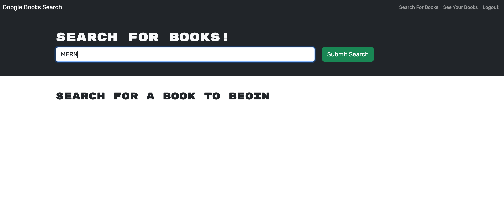

# Book-Search-Engine


## Description

The "MERN: Book Search Engine" project represents a pivotal step in transitioning from traditional RESTful APIs to GraphQL, using Apollo Server. The project takes a pre-existing Google Books API search engine, built on a MERN stack (MongoDB, Express.js, React, Node.js), and refactors it to a GraphQL API for enhanced performance and customization.

The technology stack for this project includes the MERN stack with the incorporation of Apollo Server and GraphQL. The front-end interface is built using React, with data stored in a MongoDB database. Node.js and Express.js form the backbone of the server and API. The project also involves the use of authentication middleware, modified to function within a GraphQL API context.

One of the challenges in this project is to set up an Apollo Server that uses GraphQL queries and mutations, replacing the existing RESTful API. This involves a considerable understanding of both RESTful and GraphQL APIs, as well as proficiency in Apollo Server configuration.

The problem addressed was the conversion of the RESTful API to a GraphQL API. This transition improved the performance and data handling efficiency of the application, allowing users to fetch and modify data more effectively.

The learning outcomes from this project were manifold. This project provided a hands-on experience in implementing GraphQL and Apollo Server, while enhancing understanding of the MERN stack. It also offered insights into the advantages of GraphQL over RESTful APIs, including the ability to request specific data, reducing server load and improving response times. Finally, the project offered the opportunity to work with advanced deployment techniques, deploying the application to Heroku with a MongoDB database using MongoDB Atlas.


## Table of Content

* [Installation](#installation)
* [Usage](#usage)
* [Contribution](#contribution)
* [License](#license)
  
## Made With


  
## Installation  

```
npm install
```

## Usage

To view this application,the following image shows the landing page of the application, or click on the page link that demonstrates the functionality of this project:\
<https://fierce-waters-64283.herokuapp.com/>

Homepage:


Login-signup:


Search-results:


Saved books:


## License


Link to license: <https://opensource.org/licenses/MIT>

```
Copyright (C) 2023 Gary GAO

Permission is hereby granted, free of charge, to any person obtaining a copy of this software and associated documentation files (the "Software"), to deal in the Software without restriction, including without limitation the rights to use, copy, modify, merge, publish, distribute, sublicense, and/or sell copies of the Software, and to permit persons to whom the Software is furnished to do so, subject to the following conditions:

The above copyright notice and this permission notice shall be included in all copies or substantial portions of the Software.

THE SOFTWARE IS PROVIDED "AS IS", WITHOUT WARRANTY OF ANY KIND, EXPRESS OR IMPLIED, INCLUDING BUT NOT LIMITED TO THE WARRANTIES OF MERCHANTABILITY, FITNESS FOR A PARTICULAR PURPOSE AND NONINFRINGEMENT. IN NO EVENT SHALL THE AUTHORS OR COPYRIGHT HOLDERS BE LIABLE FOR ANY CLAIM, DAMAGES OR OTHER LIABILITY, WHETHER IN AN ACTION OF CONTRACT, TORT OR OTHERWISE, ARISING FROM, OUT OF OR IN CONNECTION WITH THE SOFTWARE OR THE USE OR OTHER DEALINGS IN THE SOFTWARE.
  
```
  
## Contribution

Thanks to the starter code provided by BootCamp.

## Tests

```
N/A
```

## Questions

N/A

## Contact

* For any question about this project, please email me at: gary.yanggao@gmail.com
* To see more of my projects, follow me on Github at: <http://github.com/Mid30s>
  
[](mailto:gary.yanggao@gmail.com)
[](https://github.com/Mid30s)
